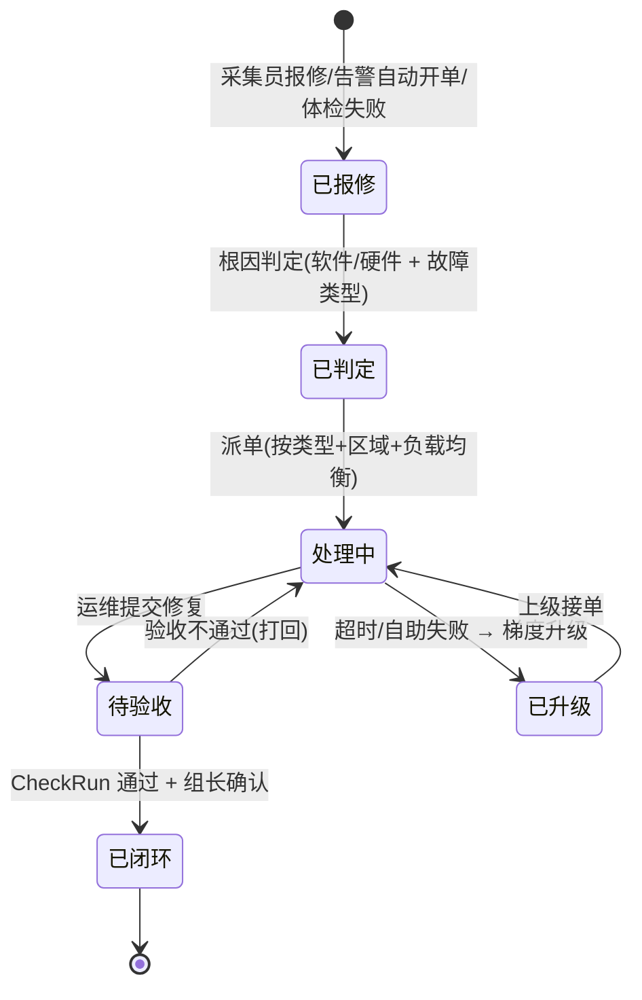
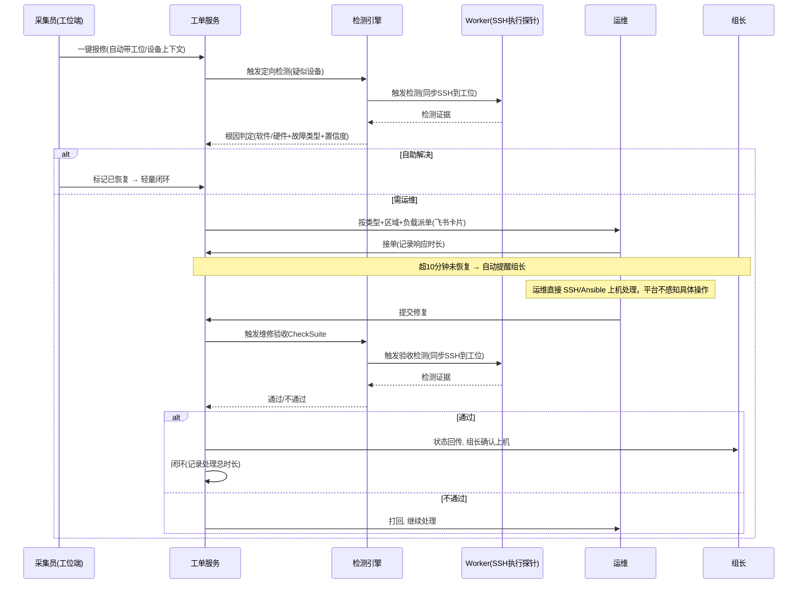

# Galio 系统架构设计

本文档承载原 README.md 中的系统架构设计细节：总体架构、端侧执行机制、服务端核心模块、数据模型、API 设计约定、关键流程、技术选型与非功能需求。

- 项目背景/目标、与 Overwatch 的关系、实施路线、风险与开放问题见 [README.md](../README.md)；
- 完整数据库 DDL 与设计评审见 [database-schema.md](database-schema.md)；
- 需求来源与完整评审稿见 README 顶部链接。

## 目录

- [总体架构](#总体架构)
- [端侧执行机制](#端侧执行机制)
- [服务端核心模块](#服务端核心模块)
- [数据模型](#数据模型)
- [API 设计约定](#api-设计约定)
- [关键流程](#关键流程)
- [技术选型](#技术选型)
- [非功能需求](#非功能需求)

## 总体架构

```mermaid
flowchart TB
    subgraph clients["用户端"]
        web["Web 控制台
(运维/组长/管理员)"]
        pad["工位端界面
(采集员: 报修/体检/指引)"]
        feishu["飞书
(通知/审批/移动查看)"]
    end

    subgraph server["平台服务端 (现场机房, docker compose 水平扩展)"]
        lb["Nginx/Traefik
负载均衡"]
        api["FastAPI 无状态副本 ×N (uv + SQLModel)
核心模块(资产/监控告警/检测/工单/发布/配置) + 运营模块(采集业务)"]
        worker["Worker 副本 ×N
定时巡检 / 检测执行 / 发布下发 / 告警评估 / 通知投递
(从 PG 作业队列领取, SKIP LOCKED；持有 SSH 凭据主动连接工位)"]
    end

    pg[("PostgreSQL — 唯一有状态组件
业务数据 / 指标分区表 / 文件表 bytea
任务队列 / 幂等键 / advisory lock")]

    registry["Docker Registry
(镜像分发设施, compose 内编排)"]

    subgraph edge["工位端 (每台采集主机, 仅对服务端网段开放 SSH 入站)"]
        probes["探针脚本
arm / hand / glove / quest / camera / env / link / svc
(随 SSH 会话临时执行, 不常驻)"]
        nodeexp["node_exporter (已预装)
:9100/metrics"]
        capture["采集软件
(状态/掉帧/异常直接调用平台 API 上报)"]
    end

    web --> lb
    pad --> lb
    lb --> api
    api --> pg
    worker --> pg
    worker -.通知.-> feishu
    worker -->|HTTP 抓取: 主机基础指标(高频)| nodeexp
    worker ==>|SSH 出站(服务端发起): 设备探针/检测/发布下发/日志拉取(低频/按需)| edge
    edge -.拉取镜像.-> registry
    capture -->|HTTPS| lb
```

> 服务进程（api / worker）**不持有任何业务状态**：幂等、去重、锁、任务领取全部由共享 PostgreSQL 保证，任意副本可随时增减、重启，请求打到哪个副本结果都一致（`docker compose up --scale api=N --scale worker=M`）。工位端**不部署任何常驻业务进程**：所有端侧动作（状态采集、检测执行、发布下发、日志拉取）都是服务端 Worker 主动发起的一次性 SSH 会话，会话结束即断开，不在工位留下长驻状态。

### 关键设计原则

1. **SSH/Ansible 是端侧执行的默认通道，能直连 HTTP 的检测/指标不绕 SSH**：工位不部署任何 Galio 自研的常驻进程，服务端不直连设备 SDK；设备专属状态/检测执行/发布下发/日志回传默认由服务端 Worker 通过 SSH 主动连接工位、执行探针脚本完成，但检测项若在工位本机就有 HTTP 状态接口（`check_item.access_method = http`），Worker 直接 HTTP 调用，不必再包一层 SSH；主机级基础指标（CPU/内存/磁盘/网络）同理复用各机已预装的 Prometheus node_exporter 走 HTTP 抓取，不引入 Prometheus Server 本身；采集软件的掉帧/异常事件直接调用平台 API 上报，不再经本机中转；
2. **服务无状态，正确性落库**：api/worker 进程内存不存任何业务状态；幂等、去重、互斥、任务领取全部由共享 PostgreSQL 承担（唯一索引 / advisory lock / `FOR UPDATE SKIP LOCKED`）——水平扩展与滚动重启因此免费获得；Worker 发起的 SSH 会话同样是无状态短连接，任意副本都能发起，SSH 凭据通过共享 secrets 挂载给所有 worker 副本，不绑定特定副本；
3. **单一存储**：PostgreSQL 是唯一有状态组件，业务数据、时序指标（分区表）、文件（bytea 文件表）、队列与锁全在其中；不引入 Redis/MinIO/消息中间件，运维面最小化；
4. **检测是一等公民**：检测项是平台的核心领域对象（可定义、可编排、可复用），体检、维修验收、发布核验、交接检查都是"检测集的一次执行"——执行者是 Worker 经 SSH 临时调用的探针脚本，不依赖任何端侧常驻进程；
5. **工单是闭环载体**：一切故障（人工报修、自动告警、体检失败）统一收敛为工单，闭环状态机强制验收；工单不记录运维在设备上具体执行了什么命令——运维直接 SSH/Ansible 上机处理，平台只感知"提交修复"这个状态转换；
6. **现场自治 + 云端出口**：平台主体部署在采集现场机房（B/C 栋局域网），弱依赖公网；工位对服务端网段开放 SSH 入站（服务端是连接发起方，工位不需要对外发起任何长连接）；飞书通知、异地查看走受控出口；
7. **机制上系统**：复盘定的管理机制（超时跟进、区域责任）以可配置的规则引擎落地，而不是硬编码。

## 端侧执行机制

工位端**不部署常驻 Agent 进程**。服务端 Worker 持有各工位的 SSH 凭据，按需/按周期主动连接工位，执行探针脚本完成状态采集、检测执行、发布下发；运维需要动手处理故障时，直接 SSH 或跑 Ansible playbook 上机修，不经平台下发命令。

### Worker 的巡检与执行职责

| 职责 | 说明 |
|-|-|
| 状态采集：主机基础指标 | Worker 按巡检周期（默认 30s，可配置）HTTP GET 各工位 node_exporter `/metrics`，解析出 CPU/内存/磁盘/网络等指标写入 `metric` |
| 状态采集：设备专属状态 | Worker 按巡检周期（默认 1 分钟，可配置）对全部在线工位并发发起 Ansible playbook，执行探针脚本采集设备状态，写入 `metric` / `station_snapshot` |
| 检测执行 | 一键体检 / 维修验收 / 发布核验 / 交接检查触发时，Worker 按 `check_item.access_method` 分组同步执行——SSH 探针脚本 / HTTP 直连状态接口都可能有，解析结果写入 `check_run` / `check_run_result` |
| 版本上报与核验 | 巡检时或发布流程中，Worker 通过 SSH 执行版本查询命令，结果写入 `version_report`；发布核验走"检测执行"同一路径 |
| 日志拉取 | 巡检异常或工单排查需要时，Worker 通过 SSH（`ansible fetch`/`scp`）按需拉取指定日志文件，分块写入 `file` / `file_chunk` |

> 相比常驻 Agent 方案，**去掉了"本地断网缓存续传"和"平台下发命令"两项能力**：工位没有进程在本地缓冲数据，断网期间的指标是真实空洞、无法补录；运维修复问题一律直接上机（SSH/Ansible），不通过平台执行远程命令。这是本次决策明确接受的代价，具体影响见[非功能需求](#非功能需求)。

### 探针脚本协议

不是所有检测都要 SSH 进工位跑一遍脚本——`check_item.access_method` 区分两种执行方式，**同一个 `check_suite` 里可以混用**，Worker 执行 `check_run` 时按这个字段分组，分别走 SSH 或 HTTP：

**`access_method = ssh`**：探针从"常驻进程内的插件接口"简化为**随 SSH 会话临时执行的命令行脚本**，统一约定：

```
probe describe          → stdout 输出该探针支持的指标与检测项清单 (JSON)
probe collect           → stdout 输出一次性采集结果 (JSON)
probe check <item_id>   → stdout 输出 {pass|fail|unknown, evidence, suggestion} (JSON)
```

Worker 通过 Ansible（`script`/`command` 模块）把脚本推到工位执行、拿到 stdout 后解析入库；探针不需要维护自己的进程生命周期，天然可被采集软件"抢占"（脚本执行时若设备句柄被占用，直接在 `evidence` 里体现为检测失败/unknown，不需要特殊协处理逻辑）。适用于必须在工位本机才能拿到的信息：读 sysfs、跑设备 SDK、执行 `adb` 命令这类。

**`access_method = http`**：有些设备/服务本身就在工位本机暴露了 HTTP 状态接口（比如下面 `svc` 探针约定的本地 HTTP 端点，或设备控制器自带的 REST 状态接口）——这种情况下 SSH 进去再跑脚本读同一个接口纯属多绕一层，Worker 直接 `GET http://{station.host}:{port}{path}` 访问，`port`/`path` 由 `check_item.params` 给出（见 database-schema.md），响应体对照 `pass_criteria` 判定结果，跟主机基础指标走 node_exporter 是同一个思路。

探针清单（`device_type`/`probe` 只标识检测的是什么，不代表固定走哪种 `access_method`——同一探针类型下不同检测项可以有的走 SSH、有的走 HTTP）：

| 探针 | 采集/检测内容 | 依赖 |
|-|-|-|
| `arm` | 机械臂状态、SDK 拖拽模式、上位机状态、超限/越线事件 | 机械臂 SDK |
| `hand` | 灵巧手状态、SDK 报错日志流 | 灵巧手 SDK |
| `glove` | 手套在线状态、线束瞬断计数（供应商质量数据） | 手套 SDK/串口 |
| `quest` | ADB 连通（区分环境问题/硬件问题）、手柄连接状态、手柄/头显电量、App 通信 | adb |
| `camera` | 枚举与连通性、协议协商结果、画面检测（黑屏/花屏/冻结帧，帧差+直方图启发式） | v4l2/厂商 SDK |
| `link` | USB 传输速率实测、接口规格（3.0 协商结果）、插口松动（错误计数/重枚举事件） | sysfs/usb |
| `env` | 内核版本、依赖包清单、镜像一致性（磁盘/CPU/内存已由 node_exporter 覆盖，不重复采） | 系统 |
| `svc` | 采集相关服务/进程运行状态、启动阶段上报（区分"启动中"与"启动失败"） | systemd/进程探测，或本机 HTTP 状态端点 |

> **启动慢 vs 坏的区分**：`svc` 探针要求被监控服务实现简单的启动阶段协议（写 status 文件，或暴露本地 HTTP 端点报告 `initializing/ready/failed + 当前阶段`）；后者对应的 `check_item` 可以直接设成 `access_method = http`，Worker HTTP 调用即可判断，不用 SSH；无法改造的服务退化为"超时阈值 + 历史启动时长基线"判断。

### 主机基础指标：复用已预装的 node_exporter

每台采集主机已预装 Prometheus **node_exporter**（标准 Linux 主机指标：CPU/内存/磁盘/网络/文件系统），暴露 `:9100/metrics`（Prometheus 文本格式）。**不引入 Prometheus Server**——只多一个有状态组件，且指标会分裂成两份存储（Prometheus TSDB + PG），与"单一存储"原则冲突。做法是 Worker 按巡检周期直接 HTTP GET 该端点，解析出需要的指标行，写入与设备专属指标同一张 `metric` 表、走同一套分区/告警逻辑，不新增组件、不新增查询入口。

这条路径不经 SSH，不受 SSH 连接开销限制，可以做到比设备专属探针高得多的采集频率（默认 30s，设备专属状态默认 1 分钟）。相应地，`env` 探针瘦身：磁盘/CPU/内存这类标准主机指标交给 node_exporter，探针脚本只保留 node_exporter 覆盖不到的部分（内核版本、依赖包清单、镜像一致性），仍按检测场景走 SSH 按需执行。

> Worker 需要预先知道每个工位主机的连接地址（用于 SSH 与 HTTP 抓取），这与原 Agent 方案（Agent 主动出站注册，服务端不需要预先知道 IP）相反，因此 `station` 表新增 `host` 字段记录主机地址，详见 [database-schema.md](database-schema.md)。

### 采集端 App 集成

采集软件内嵌轻量上报 SDK：掉帧事件、采集会话起止、设备异常**直接调用平台 API 上报**（HTTPS）。服务端不可达时由采集软件自身做本地重试缓冲（具体策略由采集软件团队实现，平台不再提供本机 Agent 兜底）。

### 通信（SSH 出站，服务端主动发起）

与常驻 Agent 方案相反，**连接由服务端 Worker 主动发起**，工位只需对服务端网段开放 SSH 入站和 node_exporter 端口，不需要对外发起任何请求：

- **主机基础指标**：Worker 高频（默认 30s）HTTP GET 各工位 node_exporter，结果写回 PG；
- **批量巡检（设备专属状态）**：Worker 定时对全部工位并发跑 Ansible playbook，执行探针脚本，结果批量写回 PG；
- **检测 / 发布**：同步 SSH 会话，执行对应探针脚本，结果落 `check_run` / `release_target` / `version_report`；
- **文件**：日志、体检证据通过 SSH 拉取后分块写入 PG 文件表（bytea）；**镜像不经平台中转**——Worker 通过 SSH 远程触发工位执行 `docker pull`，平台只下发"目标版本 + 校验和"并核验落地结果。

**离线判定**：以 node_exporter 抓取结果为主信号（频率更高、发现更快）——连续 N 次（默认 3 次，约 90s）抓取失败判工位离线；SSH 巡检失败作为设备/探针层面异常的独立信号，一并写入 `station_snapshot.last_poll_status`。

**弱网影响（相比常驻 Agent 方案的能力下降）**：工位没有进程做本地缓存，断网期间的指标数据是真实空洞、无法断点续传；网络恢复后巡检只能拿到"当前"状态，补不回历史。报修入口不受影响——工位端界面/飞书兜底入口直连服务端，与 SSH 巡检通道无关。

## 服务端核心模块

| 模块 | 说明 |
|-|-|
| 设备资产服务 | 站点(栋) → 区域 → 工位 → 设备四级实体；区域绑定责任人；台账变更全量留痕 |
| 监控告警服务 | 指标按天分区表落 PostgreSQL（明细 30 天，小时聚合 1 年）；工位实时状态 UPSERT 快照表；告警规则引擎（阈值/状态变更/心跳丢失/掉帧率）→ 去重收敛 → 通知服务 + 自动开单 |
| 检测引擎（平台核心） | 领域模型 `CheckItem`（检测项） → `CheckSuite`（检测集） → `CheckRun`（一次执行）；一键体检 / 维修验收 / 发布核验 / 交接检查四大场景复用同一引擎，均由 Worker 经 SSH 触发探针脚本执行 |
| 工单调度服务 | 报修→判定→派单→处理中→待验收→已闭环 状态机；根因判定、派单均衡、超时跟进、升级梯度、时效记录、P 级字段均可配置 |
| 发布管理服务 | 制品登记 → 测试机验证 → 审批 → 灰度下发（Worker 经 SSH/Ansible 触发工位拉取制品）→ 逐机核验 → 结果看板；版本冻结（cut off）、版本对账（期望 vs 实际漂移告警）、一键回滚 |
| 配置管理服务 | machine/importer config 模板化 + 版本化，下发走发布流水线；配置指纹比对 → 配置漂移告警 |
| 采集业务服务 | 人员-工位-任务关联；上机/下机 checklist；班次交接单（设备快照 + 未闭环工单 + 调机记录，逐项签收）；掉帧一键转报修 |
| 通知服务 | 飞书（群机器人 + 单聊卡片）、Web 站内、工位端弹窗；同工位同类告警合并、分级路由（P0 电话/加急，P2 群消息） |

### 检测场景复用

| 场景 | 触发 | 结果去向 |
|-|-|-|
| 一键健康体检 | 采集员上机前 / 排程巡检 | 不通过 → 阻断采集启动 + 自动报修 |
| 维修验收 | 工单进入"待验收" | 通过才允许关单 |
| 发布核验 | 发布任务完成后 | 不通过 → 发布标记失败 + 告警 |
| 交接检查 | 班次交接发起 | 结果写入交接单 |

### 工单状态机



## 数据模型

> 完整建表 DDL、索引策略与设计取舍见 [database-schema.md](database-schema.md)。本节只给出概念层面的约定与实体关系。

### 通用审计字段（所有表必带）

| 字段 | 类型 | 说明 |
|-|-|-|
| `created_at` | `timestamptz` | 创建时间，DB 默认 `now()` |
| `created_by` | `text` | 创建来源：内部用户/服务标识、`ingest`（定时任务/巡检写入） |
| `deleted_at` | `timestamptz?` | 软删除标记，`NULL` = 未删除；查询默认过滤 `deleted_at IS NULL` |

> 软删除注意：唯一约束要用**部分唯一索引**（`UNIQUE ... WHERE deleted_at IS NULL`）。

### 正确性保证模式（全部落在 PostgreSQL）

| 需求 | 实现 |
|-|-|
| 幂等（巡检/检测结果重复写入、任务回执重复提交） | 业务幂等键 + 部分唯一索引，`INSERT ... ON CONFLICT DO NOTHING` |
| 任务领取（worker 定时作业 / 派单） | 队列表 `SELECT ... FOR UPDATE SKIP LOCKED`，领取即置 `claimed_by/claimed_at`；超时未完成自动回收重派 |
| 互斥（冻结检查、单工位并发操作） | `pg_advisory_xact_lock(key)` 事务级咨询锁 |
| 定时作业防多副本重复触发 | 排程物化为作业行，worker 经 SKIP LOCKED 认领——不依赖进程内调度器 |
| 状态机流转防并发写 | `UPDATE ... WHERE status = <期望前态>` 乐观断言，影响行数为 0 即冲突重读 |
| 文件存储 | bytea 文件表（单文件上限 32MB、分块存储，按保留策略清理）；镜像走 Registry 不入库 |

### 核心实体关系

```mermaid
erDiagram
    SITE ||--o{ ZONE : contains
    ZONE ||--o{ STATION : contains
    ZONE ||--o{ ZONE_OWNER : "责任人(资深+新手)"
    STATION ||--o{ DEVICE : "绑定拓扑"
    DEVICE {
        string sn
        string type "arm/hand/glove/quest/camera/link"
        string lifecycle "在用/维修/报废"
    }
    STATION ||--o{ METRIC_SNAPSHOT : "实时状态(Worker巡检写入)"
    STATION ||--o{ CHECK_RUN : "体检/验收/核验/交接(Worker经SSH执行)"
    CHECK_SUITE ||--o{ CHECK_ITEM : contains
    CHECK_RUN }o--|| CHECK_SUITE : executes
    TICKET }o--|| STATION : "关于"
    TICKET }o--o| DEVICE : "定位到"
    TICKET ||--o{ TICKET_EVENT : "流转记录(时效打点)"
    TICKET }o--o| CHECK_RUN : "验收依据"
    RELEASE ||--o{ RELEASE_TARGET : "逐机结果"
    RELEASE_TARGET }o--|| STATION : on
    STATION ||--o{ VERSION_REPORT : "实际版本(Worker查询写入)"
    CONFIG_TEMPLATE ||--o{ VERSION_REPORT : "期望vs实际对账"
    PERSON ||--o{ SHIFT : "班次"
    SHIFT ||--o{ HANDOVER : "交接单"
    PERSON ||--o{ TICKET : "处理人"
    COLLECT_TASK }o--|| STATION : at
    COLLECT_TASK }o--|| PERSON : by
```



## API 设计约定

所有 HTTP API（Web 前端、工位端与采集软件上报接口）遵循同一套约定。完整接口清单见 [docs/api-design.md](api-design.md)。

### 请求通用

| 字段 / Header | 位置 | 说明 |
|-|-|-|
| `X-Request-ID` | header | 调用方传入的链路追踪 ID，可选；不传则服务端生成并在响应中回显 |
| `page` / `page_size` | query | 列表接口分页，默认 `1` / `20`，`page_size` 上限 `100` |
| `status` | query | 列表接口按状态过滤，可选 |

### 响应统一信封

```json
{
  "code": 0,               // 0 = 成功；非 0 = 业务错误码，与 HTTP 状态码配合
  "message": "ok",         // 人可读的结果说明
  "request_id": "req_abc", // 回显/生成的链路追踪 ID
  "data": { }              // 业务数据；列表接口为 { items, page, page_size, total }
}
```

列表接口的 `data`：

```json
{ "items": [], "page": 1, "page_size": 20, "total": 135 }
```

### 资源对象通用字段

随通用审计字段：`id`、`created_at`、`created_by`（时间一律 ISO-8601 UTC）；软删除记录默认不返回。

## 关键流程

### 故障报修闭环（主流程）



### 发布验证流程

测试机验证 → 审批 → 圈选目标（区域/工位）→ Worker 通过 SSH/Ansible 下发制品并远程触发工位拉取 → 逐机版本比对 + 发布核验 CheckSuite（Worker 同步 SSH 执行）→ 全量结果看板；任一机器失败即标红并开工单。冻结期内该流程入口直接拒绝。

### 上机流程

采集员登录工位端 → 领取采集任务 → 一键体检（CheckSuite: 上机体检，Worker 同步 SSH 执行）→ 全绿解锁启动 checklist → 开始采集；任一红项 → 一键报修。

## 技术选型

| 层 | 选型 | 理由 |
|-|-|-|
| 服务端 | Python：**uv**（依赖与打包）+ **FastAPI** + **SQLModel**；模块化单体，api 与 worker 两种进程形态共享同一代码库 | 团队栈统一；无状态副本水平扩展 |
| 端侧执行 | **Ansible + OpenSSH**：服务端 Worker 持有 SSH 凭据主动连接工位，探针为可执行脚本（Python/uv 编写），随 SSH 会话按需执行，不常驻 | 免维护端侧常驻进程、免自建升级/心跳协议；复用团队已有 SSH/Ansible 基础设施；代价见[非功能需求](#非功能需求)（弱网无本地缓存、设备专属指标频率受 SSH 连接开销限制） |
| 主机基础监控 | 复用各机已预装的 **Prometheus node_exporter**（`:9100/metrics`），Worker 直接 HTTP 抓取解析写入 PG，**不引入 Prometheus Server** | 免开发主机级采集探针，采集频率不受 SSH 开销限制；指标仍统一落 PG，不引入额外有状态组件 |
| 数据库 | **PostgreSQL 18**（唯一有状态组件）：业务数据 + 指标分区表 + 文件表（bytea）+ 任务队列/幂等键/advisory lock | 单一存储运维面最小；正确性全部由 PG 保证 |
| 工位连接 | SSH 出站是工位对服务端唯一开放的入站方向（服务端主动连，批量巡检用 Ansible playbook，单机/紧急场景直接 SSH）；另开放 node_exporter 端口供 HTTP 抓取 | 不自建 Agent 协议、不用维护端侧升级机制 |
| 前端 | React 19 + TypeScript + Ant Design；工位端 = 同一前端的 kiosk 模式 | 一套代码两种形态；Ant Design 覆盖控制台的布局/表格/表单等基础组件，不用自己撸一套 UI 组件库 |
| 通知 | 飞书开放平台（机器人/卡片/加急），由 worker 经 PG 通知队列投递（失败重试有痕） | 团队现用飞书 |
| 部署 | **docker compose**：nginx/traefik + api ×N + worker ×N + postgres + registry；副本数按负载 `--scale` 调整 | B/C 栋局域网内自治，服务无状态可随时增减重启，公网仅出口飞书 |

## 非功能需求

- **规模**：≥200 工位、每工位约 8 设备。指标分两条频率不同的采集路径：主机基础指标经 HTTP 抓取 node_exporter，不受 SSH 开销限制，默认 30s 一轮，200 工位量级下峰值约几十行/秒；设备专属状态经 SSH 探针，默认巡检周期 1 分钟，200 工位 × 8 设备 ≈ 1600 项指标/分钟（约 27 行/秒）。两条路径合计仍比常驻 Agent 主动推送的原设想（10s 级/2 万行分钟）低一个数量级，换来免维护端侧常驻进程；PostgreSQL 按天分区表轻松承载。需要更高时效性的场景（上机体检、验收、发布核验）不受巡检周期限制，走独立的同步 SSH 执行路径。明细 30 天/聚合 1 年，超期分区直接 `DROP`；
- **可用性**：平台故障不影响采集作业本身（采集软件直连服务端上报，与巡检通道解耦，平台不在采集数据路径上）；api/worker 无状态多副本，滚动更新零中断；**PostgreSQL 是唯一单点**：每日全量备份 + WAL 归档（恢复演练纳入上线清单），规模化后可加流复制热备；工位端界面支持只读降级（读平台侧最近一次巡检快照）；
- **弱网**：工位没有常驻进程做本地缓存——断网期间的指标数据是真实空洞，无法断点续传；巡检连续失败判工位离线（默认连续 3 次）；网络恢复后巡检只能拿到"当前"状态，历史空洞不可补录。这是放弃常驻 Agent 后明确接受的能力下降。报修在工位端不可达时提供飞书兜底入口（不经巡检通道，不受影响）；
- **安全**：不再有平台下发远程命令的通道，运维处理故障直接 SSH/Ansible 上机，命令执行与审计依赖运维团队自身的 SSH/堡垒机体系，不在 Galio 范围内；服务端↔工位为 SSH（建议每工位独立密钥对，可单独吊销），私钥由服务端集中托管（Ansible Vault 或专用 secrets 存储，不入 PG 明文库）；node_exporter 默认无鉴权，`:9100` 只对服务端网段开放，不暴露到其他网络；角色权限（采集员/采集组长/运维/管理员，共四种，无独立的"区域负责人"/"技术支持"角色）不变；
- **审计**：所有写操作（发布、配置下发、工单流转）留痕可导出；设备上的具体运维操作不由平台记录（运维直接上机执行，落在运维团队自己的 SSH/堡垒机审计里）。
