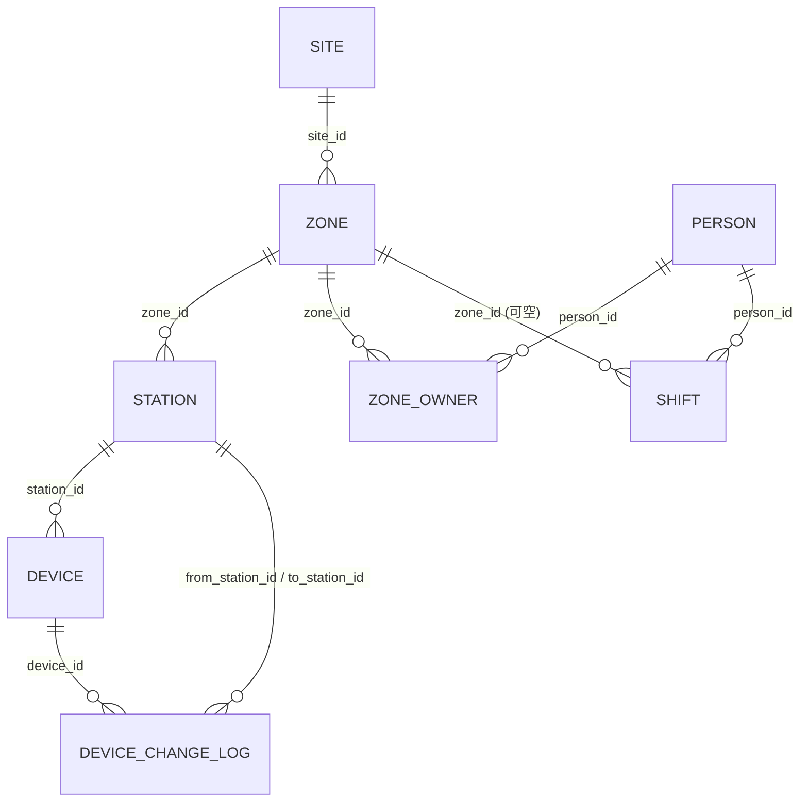
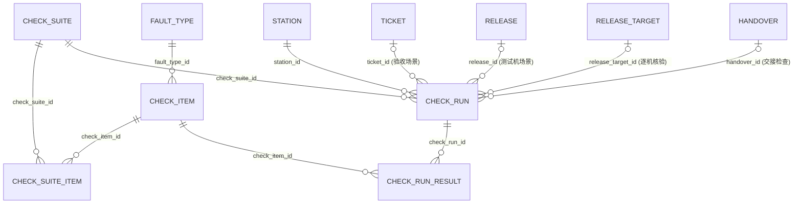
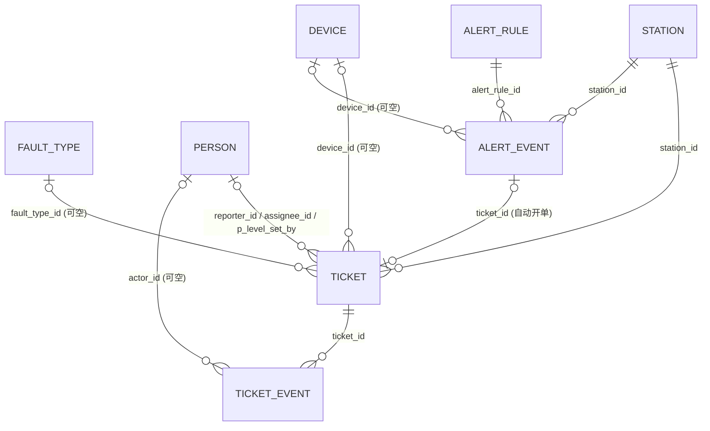
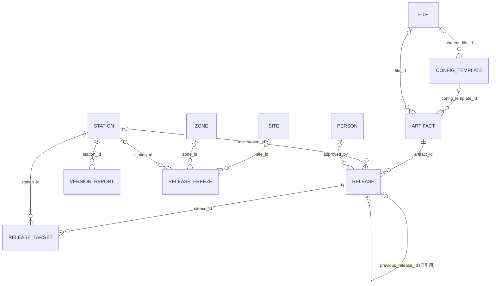
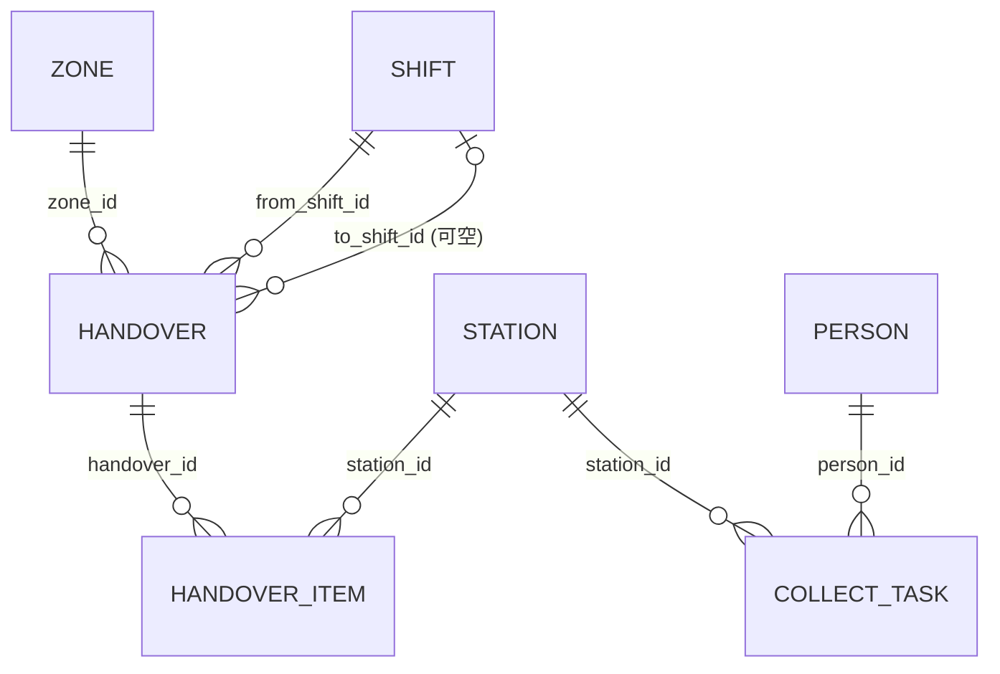

# Galio 数据库表结构设计

基于 [docs/architecture.md](architecture.md) 的数据模型、正确性保证模式与技术选型（PostgreSQL 单一存储）设计，项目背景见 [README.md](../README.md)。本设计遵循 [CLAUDE.md](../CLAUDE.md) 的 KISS 原则：表数量与架构文档中列出的领域对象基本一一对应，没有为假设中的未来需求预建表；文末「设计评审」部分列出了具体的取舍与待确认问题。

## 目录

- [通用约定](#通用约定)
- [DDL：按依赖顺序分模块](#ddl按依赖顺序分模块)
- [表关联关系](#表关联关系)
- [分区与保留策略](#分区与保留策略)
- [设计评审](#设计评审)
- [建表阶段建议（对应 M1/M2/M3）](#建表阶段建议对应-m1m2m3)

## 通用约定

| 约定 | 说明 |
|-|-|
| 主键 | 默认 `uuid primary key default gen_random_uuid()`（PG13+ 内置，无需扩展；部署目标是 **PostgreSQL 18**，见 architecture.md「技术选型」）。例外：`metric` 类高频写入的纯事实表不设代理主键（见下）|
| 通用审计字段 | `created_at timestamptz not null default now()`、`created_by text not null`、`deleted_at timestamptz`（软删除，`NULL` = 未删除）；下文各表不再重复写注释 |
| 软删除唯一约束 | 一律用 `create unique index ... where deleted_at is null`，不用表级 `UNIQUE` |
| 枚举 | 一律用 `text + check`，不用原生 `enum` 类型（改值不需要 `ALTER TYPE`，一个约束就是唯一事实来源） |
| 状态流转防并发 | 应用层用 `UPDATE ... WHERE status = <期望前态>` 乐观断言，schema 层不做特殊处理 |
| 时间 | 一律 `timestamptz`，业务层按 UTC 处理，API 输出 ISO-8601 |
| 互斥 | 冻结检查、单工位并发操作用 `pg_advisory_xact_lock(hashtext(...))`，不建锁表 |

不是所有表都带完整审计字段——队列/日志类事实表（`job`、`audit_log`、`metric`、`ticket_event`、`check_run_result`）按其生命周期简化，具体原因见「设计评审」。

## DDL：按依赖顺序分模块

### 1. 人员

```sql
create table person (
  id uuid primary key default gen_random_uuid(),
  name text not null,
  feishu_user_id text,
  primary_role text not null check (primary_role in
    ('collector','operator','team_lead','admin')),  -- 采集员/运维/采集组长/管理员，仅这四种
  status text not null default 'active' check (status in ('active','inactive')),
  created_at timestamptz not null default now(),
  created_by text not null,
  deleted_at timestamptz
);
create unique index uq_person_feishu on person(feishu_user_id)
  where deleted_at is null and feishu_user_id is not null;
```

### 2. 文件（bytea 存储）

文件元数据与二进制分块拆成两张表：元数据可被其他表正常 FK 引用，分块只按 `(file_id, chunk_index)` 存取。

```sql
create table file (
  id uuid primary key default gen_random_uuid(),
  filename text not null,
  content_type text not null,
  total_size_bytes bigint not null,
  chunk_count integer not null,
  owner_type text not null check (owner_type in
    ('ticket_evidence','check_run_evidence','log_archive','artifact_package',
     'config_template','handover_attachment')),
  owner_id uuid,                    -- 关联对象 id；上传时对象可能尚未创建，允许为空后续回填
  created_at timestamptz not null default now(),
  created_by text not null,
  deleted_at timestamptz
);
create index ix_file_owner on file(owner_type, owner_id) where deleted_at is null;

create table file_chunk (
  file_id uuid not null references file(id),
  chunk_index integer not null,
  chunk_size_bytes integer not null check (chunk_size_bytes <= 33554432), -- 32MB
  data bytea not null,
  primary key (file_id, chunk_index)
);
```

### 3. 资产：站点 / 区域 / 工位 / 设备

```sql
create table site (
  id uuid primary key default gen_random_uuid(),
  code text not null,               -- 栋：B / C
  name text not null,
  created_at timestamptz not null default now(),
  created_by text not null,
  deleted_at timestamptz
);
create unique index uq_site_code on site(code) where deleted_at is null;

create table zone (
  id uuid primary key default gen_random_uuid(),
  site_id uuid not null references site(id),
  code text not null,
  name text not null,
  created_at timestamptz not null default now(),
  created_by text not null,
  deleted_at timestamptz
);
create unique index uq_zone_site_code on zone(site_id, code) where deleted_at is null;

create table zone_owner (
  id uuid primary key default gen_random_uuid(),
  zone_id uuid not null references zone(id),
  person_id uuid not null references person(id),
  seniority text not null check (seniority in ('senior','junior')),  -- 资深 + 新手搭配
  created_at timestamptz not null default now(),
  created_by text not null,
  deleted_at timestamptz
);
create unique index uq_zone_owner on zone_owner(zone_id, person_id) where deleted_at is null;

create table station (
  id uuid primary key default gen_random_uuid(),
  zone_id uuid not null references zone(id),
  code text not null,
  name text not null,
  host text,                        -- 采集主机的 SSH/node_exporter 连接地址(hostname 或 IP);
                                     -- Worker 主动连接工位需要预先知道地址,注册前可为空
  status text not null default 'active' check (status in ('active','disabled')),
  created_at timestamptz not null default now(),
  created_by text not null,
  deleted_at timestamptz
);
create unique index uq_station_zone_code on station(zone_id, code) where deleted_at is null;
create unique index uq_station_host on station(host) where deleted_at is null and host is not null;

create table device (
  id uuid primary key default gen_random_uuid(),
  station_id uuid not null references station(id),
  sn text not null,
  type text not null check (type in ('arm','hand','glove','quest','camera','link')),
  model text,
  lifecycle text not null default 'in_service'
    check (lifecycle in ('in_service','under_repair','retired')),
  created_at timestamptz not null default now(),
  created_by text not null,
  deleted_at timestamptz
);
create unique index uq_device_sn on device(sn) where deleted_at is null;
create index ix_device_station on device(station_id) where deleted_at is null;

-- 台账变更全量留痕（更换/维修/报废），不可变日志，不设 deleted_at
create table device_change_log (
  id uuid primary key default gen_random_uuid(),
  device_id uuid not null references device(id),
  change_type text not null check (change_type in
    ('replace','repair','retire','reactivate','relocate')),
  from_station_id uuid references station(id),
  to_station_id uuid references station(id),
  note text,
  created_at timestamptz not null default now(),
  created_by text not null
);
```

### 4. 人员补充：班次

```sql
create table shift (
  id uuid primary key default gen_random_uuid(),
  person_id uuid not null references person(id),
  zone_id uuid references zone(id),
  shift_type text not null check (shift_type in ('day','night')),
  starts_at timestamptz not null,
  ends_at timestamptz,
  created_at timestamptz not null default now(),
  created_by text not null,
  deleted_at timestamptz
);
create index ix_shift_person_time on shift(person_id, starts_at desc);
```

### 5. 检测字典：故障类型 / 检测项 / 检测集

```sql
create table fault_type (
  id uuid primary key default gen_random_uuid(),
  code text not null,
  name text not null,
  category text not null check (category in ('hardware','software')),
  created_at timestamptz not null default now(),
  created_by text not null,
  deleted_at timestamptz
);
create unique index uq_fault_type_code on fault_type(code) where deleted_at is null;

create table check_item (
  id uuid primary key default gen_random_uuid(),
  name text not null,
  device_type text not null check (device_type in
    ('arm','hand','glove','quest','camera','link','env','svc')),  -- env/svc 检测的是主机/服务，非物理设备
  probe text not null,              -- 执行探针标识
  access_method text not null default 'ssh' check (access_method in ('ssh','http')),
    -- ssh: Worker 经 SSH 执行 probe 对应的探针脚本（见 architecture.md「探针脚本协议」）；
    -- http: 探针在工位本机就暴露了 HTTP 状态接口（比如 svc 探针约定的本地 HTTP 端点，
    -- 或设备控制器自带的 REST 状态接口），Worker 直接 HTTP 调用，不必再包一层 SSH。
    -- 两种方式在同一个 check_suite 里可以混用，执行时按 access_method 分组分别处理。
  params jsonb not null default '{}'::jsonb,
    -- access_method=ssh 时是探针脚本参数；access_method=http 时约定 {"port": int, "path": text}，
    -- 请求地址拼成 http://{station.host}:{port}{path}
  pass_criteria jsonb not null,
  fault_type_id uuid references fault_type(id),
  status text not null default 'active' check (status in ('active','disabled')),
  created_at timestamptz not null default now(),
  created_by text not null,
  deleted_at timestamptz
);
create index ix_check_item_device_type on check_item(device_type) where deleted_at is null;

create table check_suite (
  id uuid primary key default gen_random_uuid(),
  name text not null,
  scenario text not null check (scenario in
    ('pre_op_check','repair_acceptance','release_verify','handover_check')),
  device_type text,                 -- 为空 = 跨设备类型的整机/工位级 suite
  status text not null default 'active' check (status in ('active','disabled')),
  created_at timestamptz not null default now(),
  created_by text not null,
  deleted_at timestamptz
);
create index ix_check_suite_scenario on check_suite(scenario) where deleted_at is null;

create table check_suite_item (
  check_suite_id uuid not null references check_suite(id),
  check_item_id uuid not null references check_item(id),
  seq integer not null,
  primary key (check_suite_id, check_item_id)
);
create unique index uq_check_suite_item_seq on check_suite_item(check_suite_id, seq);
```

### 6. 工单

```sql
create table ticket (
  id uuid primary key default gen_random_uuid(),
  station_id uuid not null references station(id),
  device_id uuid references device(id),
  source text not null check (source in ('manual_report','alert_auto','check_fail')),
  fault_type_id uuid references fault_type(id),
  fault_category text check (fault_category in ('hardware','software')),
  p_level integer check (p_level between 0 and 3),
  p_level_set_by uuid references person(id),
  p_level_set_at timestamptz,
  status text not null default 'reported' check (status in
    ('reported','triaged','in_progress','pending_acceptance','closed','escalated')),
  assignee_id uuid references person(id),
  reporter_id uuid references person(id),
  self_resolved boolean not null default false,
  reported_at timestamptz not null default now(),
  dispatched_at timestamptz,
  accepted_at timestamptz,
  resolved_at timestamptz,
  closed_at timestamptz,
  response_seconds integer,         -- 派单→接单，状态流转时由应用计算写入
  resolution_seconds integer,       -- 报修→闭环
  created_at timestamptz not null default now(),
  created_by text not null,
  deleted_at timestamptz
);
create index ix_ticket_station_status on ticket(station_id, status) where deleted_at is null;
create index ix_ticket_assignee_status on ticket(assignee_id, status) where deleted_at is null;
create index ix_ticket_reported_at on ticket(reported_at);

-- 验收记录（哪次 CheckRun 通过关闭了工单）通过 check_run.ticket_id 反查，不在此表冗余存储

create table ticket_event (
  id uuid primary key default gen_random_uuid(),
  ticket_id uuid not null references ticket(id),
  event_type text not null check (event_type in
    ('reported','triaged','dispatched','accepted','resubmitted',
     'acceptance_passed','acceptance_rejected','escalated','closed','note')),
  actor_id uuid references person(id),
  detail jsonb,
  created_at timestamptz not null default now(),
  created_by text not null
);
create index ix_ticket_event_ticket on ticket_event(ticket_id, created_at);
```

### 7. 发布与配置

```sql
create table config_template (
  id uuid primary key default gen_random_uuid(),
  name text not null,
  applies_to text not null check (applies_to in ('machine_config','importer_config')),
  device_model text,
  content_file_id uuid references file(id),
  current_version text not null,
  created_at timestamptz not null default now(),
  created_by text not null,
  deleted_at timestamptz
);

create table artifact (
  id uuid primary key default gen_random_uuid(),
  artifact_type text not null check (artifact_type in ('image','package','config_template')),
  name text not null,
  version text not null,
  image_ref text,                   -- artifact_type = 'image' 时：registry 镜像地址
  checksum text not null,
  file_id uuid references file(id), -- artifact_type in ('package','config_template') 时
  config_template_id uuid references config_template(id),
  created_at timestamptz not null default now(),
  created_by text not null,
  deleted_at timestamptz
);
create unique index uq_artifact_name_version on artifact(name, version) where deleted_at is null;

create table release (
  id uuid primary key default gen_random_uuid(),
  artifact_id uuid not null references artifact(id),
  status text not null default 'draft' check (status in
    ('draft','testing','approved','rolling_out','completed','failed','rolled_back')),
  test_station_id uuid references station(id),
  approved_by uuid references person(id),
  approved_at timestamptz,
  previous_release_id uuid references release(id),  -- 回滚指针
  created_at timestamptz not null default now(),
  created_by text not null,
  deleted_at timestamptz
);
-- 测试机验证结果通过 check_run.release_id + release.test_station_id 反查

create table release_target (
  id uuid primary key default gen_random_uuid(),
  release_id uuid not null references release(id),
  station_id uuid not null references station(id),
  status text not null default 'pending' check (status in
    ('pending','deploying','verifying','success','failed','skipped')),
  actual_version text,
  checksum_verified boolean not null default false,
  deployed_at timestamptz,
  verified_at timestamptz,
  created_at timestamptz not null default now(),
  created_by text not null default 'ingest',
  deleted_at timestamptz
);
create unique index uq_release_target on release_target(release_id, station_id) where deleted_at is null;
create index ix_release_target_status on release_target(release_id, status);
-- 逐机核验结果通过 check_run.release_target_id 反查

create table version_report (
  id uuid primary key default gen_random_uuid(),
  station_id uuid not null references station(id),
  module text not null,             -- 上报的模块标识：hand_sdk / capture_app / importer ...
  reported_version text not null,
  config_fingerprint text,
  reported_at timestamptz not null default now(),
  created_at timestamptz not null default now(),
  created_by text not null default 'ingest'
);
create index ix_version_report_latest on version_report(station_id, module, reported_at desc);
-- 期望 vs 实际的漂移判断是查询逻辑（取每 station+module 最新一行与 config_template/release 目标版本比对），
-- 不额外维护一张"当前状态"表，避免双写不一致

create table release_freeze (
  id uuid primary key default gen_random_uuid(),
  scope_type text not null check (scope_type in ('global','site','zone','station')),
  site_id uuid references site(id),
  zone_id uuid references zone(id),
  station_id uuid references station(id),
  reason text not null,
  starts_at timestamptz not null default now(),
  ends_at timestamptz,
  status text not null default 'active' check (status in ('active','released')),
  created_at timestamptz not null default now(),
  created_by text not null,
  released_by text,
  released_at timestamptz,
  constraint ck_release_freeze_scope check (
    (scope_type = 'global' and site_id is null and zone_id is null and station_id is null) or
    (scope_type = 'site'   and site_id is not null and zone_id is null and station_id is null) or
    (scope_type = 'zone'   and zone_id is not null and station_id is null) or
    (scope_type = 'station' and station_id is not null)
  )
);
create index ix_release_freeze_active on release_freeze(scope_type, site_id, zone_id, station_id)
  where status = 'active';
```

### 8. 采集业务与交接

```sql
create table collect_task (
  id uuid primary key default gen_random_uuid(),
  station_id uuid not null references station(id),
  person_id uuid not null references person(id),
  task_name text not null,
  status text not null default 'in_progress' check (status in ('in_progress','completed','aborted')),
  started_at timestamptz not null default now(),
  ended_at timestamptz,
  frame_drop_count integer not null default 0,
  created_at timestamptz not null default now(),
  created_by text not null,
  deleted_at timestamptz
);
create index ix_collect_task_station on collect_task(station_id, started_at desc);

create table handover (
  id uuid primary key default gen_random_uuid(),
  zone_id uuid not null references zone(id),
  from_shift_id uuid not null references shift(id),
  to_shift_id uuid references shift(id),
  station_snapshot jsonb not null,      -- 交班时点的设备状态快照，历史记录，不建 FK
  open_ticket_ids uuid[] not null default '{}',  -- 同上：时点快照，非实时关系
  status text not null default 'pending_confirm' check (status in
    ('pending_confirm','confirmed','escalated')),
  confirmed_by uuid references person(id),
  confirmed_at timestamptz,
  escalated_at timestamptz,
  created_at timestamptz not null default now(),
  created_by text not null,
  deleted_at timestamptz
);

create table handover_item (
  id uuid primary key default gen_random_uuid(),
  handover_id uuid not null references handover(id),
  station_id uuid not null references station(id),
  note text,
  confirmed boolean not null default false,
  confirmed_at timestamptz,
  created_at timestamptz not null default now(),
  created_by text not null
);
create index ix_handover_item_handover on handover_item(handover_id);
```

### 9. 检测执行记录

放在业务表（ticket / release / handover）之后建，因为 `check_run` 需要引用它们。

```sql
create table check_run (
  id uuid primary key default gen_random_uuid(),
  check_suite_id uuid not null references check_suite(id),
  station_id uuid not null references station(id),
  trigger_reason text not null check (trigger_reason in
    ('manual','ticket','release','schedule','handover')),
  ticket_id uuid references ticket(id),
  release_id uuid references release(id),
  release_target_id uuid references release_target(id),
  handover_id uuid references handover(id),
  conclusion text check (conclusion in ('pass','fail','partial')),
  started_at timestamptz not null default now(),
  finished_at timestamptz,
  created_at timestamptz not null default now(),
  created_by text not null,
  deleted_at timestamptz
);
create index ix_check_run_station on check_run(station_id, started_at desc);
create index ix_check_run_ticket on check_run(ticket_id) where ticket_id is not null;
create index ix_check_run_release_target on check_run(release_target_id) where release_target_id is not null;

create table check_run_result (
  id uuid primary key default gen_random_uuid(),
  check_run_id uuid not null references check_run(id),
  check_item_id uuid not null references check_item(id),
  result text not null check (result in ('pass','fail','unknown')),
  evidence jsonb,
  suggestion text,                  -- 探针 Check() 返回的处理建议文案
  created_at timestamptz not null default now(),
  created_by text not null default 'ingest'
);
create unique index uq_check_run_result on check_run_result(check_run_id, check_item_id);
```

### 10. 监控与告警

```sql
-- 高频写入的纯时序事实表，不设代理主键、不做软删除，靠分区 + 保留策略清理
create table metric (
  station_id uuid not null references station(id),
  device_id uuid references device(id),
  metric_name text not null,        -- battery_level / link_rate / frame_drop_rate / ...
  metric_value double precision not null,
  recorded_at timestamptz not null,
  created_at timestamptz not null default now(),
  created_by text not null default 'ingest'
) partition by range (recorded_at);

create index ix_metric_query on metric(station_id, metric_name, recorded_at desc);
create index ix_metric_recorded_at_brin on metric using brin(recorded_at);

create table metric_hourly_agg (
  station_id uuid not null references station(id),
  device_id uuid references device(id),
  metric_name text not null,
  hour_bucket timestamptz not null,
  avg_value double precision not null,
  min_value double precision not null,
  max_value double precision not null,
  sample_count integer not null,
  primary key (station_id, metric_name, hour_bucket, device_id)
) partition by range (hour_bucket);

-- 每工位一行的实时状态快照，UPSERT 更新
create table station_snapshot (
  station_id uuid primary key references station(id),
  status text not null check (status in ('online','offline','degraded')),
  last_polled_at timestamptz,               -- 最近一次 node_exporter 抓取成功时间
  last_poll_status text check (last_poll_status in ('ok','unreachable')),
  last_poll_error text,                     -- SSH/HTTP 巡检失败原因，供排查
  health jsonb not null default '{}'::jsonb,   -- 六项核心状态矩阵快照
  active_ticket_count integer not null default 0,
  updated_at timestamptz not null default now()
);

create table alert_rule (
  id uuid primary key default gen_random_uuid(),
  name text not null,
  rule_type text not null check (rule_type in
    ('threshold','status_change','heartbeat_lost','frame_drop_rate')),
  scope_device_type text,
  config jsonb not null,            -- 阈值/条件参数
  severity text not null check (severity in ('p0','p1','p2','p3')),
  enabled boolean not null default true,
  auto_create_ticket boolean not null default false,
  created_at timestamptz not null default now(),
  created_by text not null,
  deleted_at timestamptz
);

create table alert_event (
  id uuid primary key default gen_random_uuid(),
  alert_rule_id uuid not null references alert_rule(id),
  station_id uuid not null references station(id),
  device_id uuid references device(id),
  severity text not null,
  status text not null default 'open' check (status in ('open','acked','resolved','suppressed')),
  occurrence_count integer not null default 1,   -- 去重收敛：同条件重复触发时自增而非新建行
  detail jsonb not null,
  ticket_id uuid references ticket(id),
  opened_at timestamptz not null default now(),
  resolved_at timestamptz,
  created_at timestamptz not null default now(),
  created_by text not null default 'ingest',
  deleted_at timestamptz
);
create unique index uq_alert_event_open
  on alert_event(alert_rule_id, station_id, coalesce(device_id, '00000000-0000-0000-0000-000000000000'))
  where status = 'open' and deleted_at is null;
```

### 11. 定时作业与通知

```sql
-- 排程物化为行，worker 经 SKIP LOCKED 认领，不依赖进程内调度器
create table job (
  id uuid primary key default gen_random_uuid(),
  job_type text not null check (job_type in
    ('metric_partition_maintain','alert_evaluate','notification_dispatch',
     'version_reconcile','partition_cleanup')),
  scheduled_for timestamptz not null,
  status text not null default 'pending' check (status in ('pending','claimed','done','failed')),
  claimed_by text,
  claimed_at timestamptz,
  finished_at timestamptz,
  error text,
  created_at timestamptz not null default now(),
  created_by text not null default 'ingest'
);
create index ix_job_pending on job(job_type, scheduled_for) where status = 'pending';

create table notification (
  id uuid primary key default gen_random_uuid(),
  channel text not null check (channel in
    ('feishu_group','feishu_dm','feishu_urgent_call','feishu_urgent_sms','web','kiosk')),
  target text not null,             -- 群 id / 用户 id 等
  template text not null,
  payload jsonb not null,
  priority text not null default 'normal' check (priority in ('p0','p1','p2','normal')),
  status text not null default 'pending' check (status in ('pending','sending','sent','failed')),
  attempt_count integer not null default 0,
  last_error text,
  claimed_at timestamptz,
  sent_at timestamptz,
  created_at timestamptz not null default now(),
  created_by text not null
);
create index ix_notification_pending on notification(status, priority, created_at);
```

### 12. 审计日志

```sql
-- 不可变日志，不设 deleted_at
create table audit_log (
  id uuid primary key default gen_random_uuid(),
  actor text not null,
  action text not null,             -- 'release.publish' / 'ticket.transition' / 'config.push' ...
  entity_type text not null,
  entity_id uuid,
  request_id text,
  detail jsonb,
  created_at timestamptz not null default now()
);
create index ix_audit_log_entity on audit_log(entity_type, entity_id);
create index ix_audit_log_created_at on audit_log(created_at);
```

## 表关联关系

architecture.md 的[核心实体关系](architecture.md#数据模型)图是概念层面的简化版（用业务实体名，不逐列展开）。本节对应到上面 35 张实际的表和列名，给出完整、可核对的关联关系。

### 关系类型

不是所有"关联"都是数据库外键，混在一起描述容易误导，分三类：

| 类型 | 含义 | 例子 |
|-|-|-|
| **强外键** | 有 `references` + FK 约束，DB 层保证引用完整性 | `device.station_id → station(id)` |
| **弱关联** | 语义上相关，但没有建 FK（多态引用，或成本大于收益），引用完整性靠应用层 | `file.owner_type/owner_id`（可能指向 6 种表之一） |
| **时点快照** | 存的是某一时刻的值/id 列表，不代表当前仍然成立的关系，不建 FK | `handover.open_ticket_ids`、`station_snapshot.health` |

### 完整外键清单

按 DDL 的模块编号（与上文"1. 人员"…"12. 审计日志"一一对应）列出每张表的每个外键列。没有外键的表只列一行说明。

**1-2. 人员 / 文件**

| 表 | 列 | 引用 | 可空 | 说明 |
|-|-|-|-|-|
| `person` | — | 无外键 | | |
| `file` | `owner_id` | 弱关联（无 FK），语义上指向 `owner_type` 对应的 6 类表之一 | 是 | 上传时对象可能还没创建 |
| `file_chunk` | `file_id` | `file(id)` | 否 | |

**3-4. 资产 / 班次**

| 表 | 列 | 引用 | 可空 | 说明 |
|-|-|-|-|-|
| `site` | — | 无外键 | | |
| `zone` | `site_id` | `site(id)` | 否 | |
| `zone_owner` | `zone_id` | `zone(id)` | 否 | |
| `zone_owner` | `person_id` | `person(id)` | 否 | |
| `station` | `zone_id` | `zone(id)` | 否 | |
| `device` | `station_id` | `station(id)` | 否 | |
| `device_change_log` | `device_id` | `device(id)` | 否 | |
| `device_change_log` | `from_station_id` / `to_station_id` | `station(id)` | 是 | `relocate` 类型才两列都有值 |
| `shift` | `person_id` | `person(id)` | 否 | |
| `shift` | `zone_id` | `zone(id)` | 是 | 未绑定区域时为空 |

**5-6. 检测字典 / 工单**

| 表 | 列 | 引用 | 可空 | 说明 |
|-|-|-|-|-|
| `fault_type` | — | 无外键 | | |
| `check_item` | `fault_type_id` | `fault_type(id)` | 是 | 该检测项失败时归属的故障类型 |
| `check_suite` | — | 无外键 | | |
| `check_suite_item` | `check_suite_id` | `check_suite(id)` | 否 | 与 `check_item_id` 联合主键 |
| `check_suite_item` | `check_item_id` | `check_item(id)` | 否 | |
| `ticket` | `station_id` | `station(id)` | 否 | |
| `ticket` | `device_id` | `device(id)` | 是 | 报修能定位到具体设备时才有值 |
| `ticket` | `fault_type_id` | `fault_type(id)` | 是 | 判定后写入 |
| `ticket` | `p_level_set_by` / `assignee_id` / `reporter_id` | `person(id)` | 是 | |
| `ticket_event` | `ticket_id` | `ticket(id)` | 否 | |
| `ticket_event` | `actor_id` | `person(id)` | 是 | 系统自动流转（如超时升级）时为空 |

**7. 发布与配置**

| 表 | 列 | 引用 | 可空 | 说明 |
|-|-|-|-|-|
| `config_template` | `content_file_id` | `file(id)` | 是 | |
| `artifact` | `file_id` | `file(id)` | 是 | `artifact_type` 为 package/config_template 时有值 |
| `artifact` | `config_template_id` | `config_template(id)` | 是 | `artifact_type = config_template` 时有值 |
| `release` | `artifact_id` | `artifact(id)` | 否 | |
| `release` | `test_station_id` | `station(id)` | 是 | 测试机验证阶段用 |
| `release` | `approved_by` | `person(id)` | 是 | 审批通过后写入 |
| `release` | `previous_release_id` | `release(id)` 自引用 | 是 | 回滚指针，串成链表 |
| `release_target` | `release_id` | `release(id)` | 否 | |
| `release_target` | `station_id` | `station(id)` | 否 | |
| `version_report` | `station_id` | `station(id)` | 否 | |
| `release_freeze` | `site_id` / `zone_id` / `station_id` | `site(id)` / `zone(id)` / `station(id)` | 是（按 `scope_type` 互斥） | 见 `ck_release_freeze_scope` |

**8-9. 采集业务与交接 / 检测执行记录**

| 表 | 列 | 引用 | 可空 | 说明 |
|-|-|-|-|-|
| `collect_task` | `station_id` | `station(id)` | 否 | |
| `collect_task` | `person_id` | `person(id)` | 否 | |
| `handover` | `zone_id` | `zone(id)` | 否 | |
| `handover` | `from_shift_id` | `shift(id)` | 否 | |
| `handover` | `to_shift_id` | `shift(id)` | 是 | 接班人尚未确定时为空 |
| `handover` | `open_ticket_ids` | 时点快照（`uuid[]`，无 FK） | | 交接时点的未闭环工单列表 |
| `handover_item` | `handover_id` | `handover(id)` | 否 | |
| `handover_item` | `station_id` | `station(id)` | 否 | |
| `check_run` | `check_suite_id` | `check_suite(id)` | 否 | |
| `check_run` | `station_id` | `station(id)` | 否 | |
| `check_run` | `ticket_id` / `release_id` / `release_target_id` / `handover_id` | 对应表 `(id)` | 是（四选一或都空） | 由 `trigger_reason` 决定哪个非空；四张表反过来都不存 `check_run_id`，查最新验证结果统一从这四个 FK 反查 `check_run`（见「设计评审」#3） |
| `check_run_result` | `check_run_id` | `check_run(id)` | 否 | |
| `check_run_result` | `check_item_id` | `check_item(id)` | 否 | |

**10. 监控与告警**

| 表 | 列 | 引用 | 可空 | 说明 |
|-|-|-|-|-|
| `metric` | `station_id` | `station(id)` | 否 | |
| `metric` | `device_id` | `device(id)` | 是 | `env`/`svc` 类主机级指标不挂设备，为空 |
| `metric_hourly_agg` | `station_id` | `station(id)` | 否 | |
| `metric_hourly_agg` | `device_id` | `device(id)` | 声明为可空，但作为主键列会被 PG 隐式加 NOT NULL——与 `metric.device_id`（主机级指标可为空）矛盾，属未修的已知问题 | |
| `station_snapshot` | `station_id` | `station(id)`，同时是本表主键 | 否 | 每工位 1 行，1:1 |
| `station_snapshot` | `health` | 弱关联（jsonb，无 FK） | | 六项状态矩阵的冗余快照，来源是 `metric`/`check_run` 等，不保证强一致 |
| `alert_rule` | — | 无外键 | | |
| `alert_event` | `alert_rule_id` | `alert_rule(id)` | 否 | |
| `alert_event` | `station_id` | `station(id)` | 否 | |
| `alert_event` | `device_id` | `device(id)` | 是 | |
| `alert_event` | `ticket_id` | `ticket(id)` | 是 | 自动开单后回填 |

**11-12. 定时作业与通知 / 审计日志**

| 表 | 列 | 引用 | 可空 | 说明 |
|-|-|-|-|-|
| `job` | — | 无外键 | | |
| `notification` | `target` | 弱关联（text，无 FK） | | 群 id / 用户 id，格式随 `channel` 变化 |
| `audit_log` | `entity_id` | 弱关联（uuid，无 FK） | 是 | 具体指向哪张表由 `entity_type` 描述，审计日志故意不建 FK（被审计对象可能已被物理删除，但日志要保留） |

### 分模块关系图

对应上面清单，按业务域拆成几张图，避免 35 个实体挤在一张图里无法阅读。

**A. 资产与人员骨架**



**B. 检测引擎（检测项/检测集/执行记录）**



**C. 工单与告警**



**D. 发布与配置**



**E. 采集业务与班次交接**



`file` ↔ `file_chunk` 是唯一一对 1:N 的文件分块关系（`file_chunk.file_id → file(id)`），只有一条边，不单独画图。`job`、`notification`、`audit_log` 与业务表没有强外键关联（`job.job_type`、`notification.target`、`audit_log.entity_id` 均为独立标识/弱关联），同样不单独画图。

## 分区与保留策略

- `metric`：按天 `RANGE (recorded_at)` 分区，明细保留 30 天；`job` 类型 `metric_partition_maintain` 每日提前创建未来分区、`DROP` 超期分区；
- `metric_hourly_agg`：按月分区，保留 1 年，同样由 `partition_cleanup` job 维护；
- 分区创建示例：

```sql
create table metric_y2026m09d05 partition of metric
  for values from ('2026-09-05') to ('2026-09-06');
```

## 设计评审

以下是本设计中做出的关键取舍、明显的偏离点，以及需要团队确认的开放问题。

### 已做出的取舍（KISS 相关）

1. **`metric` 不设代理主键、不做软删除**：作为纯追加的高频时序事实表（峰值约 333 行/秒），额外的 uuid 主键和索引只增加写入开销，没有实际收益；读取路径靠 `(station_id, metric_name, recorded_at)` 索引和 BRIN 索引即可。这是刻意偏离"所有表都带 uuid 主键+审计字段"的通用约定。
2. **队列/日志类表简化审计字段**：`job`、`audit_log`、`ticket_event`、`check_run_result` 没有 `deleted_at`。它们要么是不可变日志（永久保留，靠归档而非软删除下线），要么是短生命周期队列行（终态后由保留策略物理 `DELETE`，软删除没有意义）。**架构文档「数据模型 > 通用审计字段」写的是"所有表必带"，这里是明确的偏离，建议评审时确认是否接受。**
3. **移除了会造成建表环形依赖的反向外键**：`ticket.acceptance_check_run_id`、`release.test_check_run_id`、`release_target.verify_check_run_id` 均未建，因为 `check_run` 已经用 `ticket_id` / `release_id` / `release_target_id` 记录了同一关系。查最新一次验证结果统一用 `SELECT ... FROM check_run WHERE xxx_id = ? ORDER BY started_at DESC`，避免同一关系存两份、双写不一致。
4. **没有做通用 RBAC 表**（`role` / `permission` / `role_permission`）：角色是固定的四种（采集员/运维/采集组长/管理员，没有"区域负责人"/"技术支持"这两个独立角色），用 `person.primary_role` 一个 text 字段即可覆盖当前所有派单/权限规则；`zone_owner` 表达的是"哪些人（不限角色，实践中是运维/采集组长）对某区域负责"的绑定关系，不是一种独立角色，所以不在 `primary_role` 枚举里出现。如果后续出现"按功能点配置权限"的需求，再引入真正的 RBAC——现在建是过度设计。
5. **`version_report` 不维护"当前状态"物化表**：期望版本 vs 实际版本的漂移判断是一条查询（取每 `station+module` 最新上报行，与 `config_template`/`release` 目标版本比对），而不是额外维护一张会和上报流水不一致的状态表。如果后续这个查询成为大盘热点且性能不够，再加物化视图或触发器维护的快照表。
6. **`file` 的 `owner_type/owner_id` 是本设计里唯一的"弱外键"（无 FK 约束）**：因为文件真实挂载在 6+ 种不同实体上，为每种实体单独建关联表收益不大。代价是数据库层面不保证引用完整性，需要应用层保证，并建议后续加一个定期扫描孤儿文件的 job。
7. **`release_freeze` 用 3 个可空 FK + CHECK 约束**表达作用域（而不是弱外键 `scope_id`）：因为这张表小、写入不频繁，多花几行 CHECK 换来数据库强制的引用完整性划算。
8. **去掉了 `agent`/`agent_task`/`ingest_batch` 三张表（原 38 张降到 35 张）**：架构决策改为不部署端侧常驻 Agent，状态采集/检测执行/发布下发全部由服务端 Worker 主动 SSH 到工位执行，不再需要"Agent 注册身份"、"Agent 任务队列"、"批量上报幂等键"这三件事。相应地：`station` 新增可空的 `host` 字段（Worker 需要预先知道连接地址，与原 Agent 主动出站注册相反）；`station_snapshot` 用 `last_polled_at`/`last_poll_status`/`last_poll_error` 替代原来基于 Agent 心跳的在线判定。
9. **`check_item` 加 `access_method`（ssh/http）而不是假设所有检测都走 SSH**：不是所有探针都需要 SSH 登录执行脚本——有些设备/服务本身就在工位本机暴露了 HTTP 状态接口（`svc` 探针约定的本地 HTTP 端点就是一例），这种情况直接 HTTP 调用比"SSH 进去再跑一次脚本读同一个 HTTP 端点"绕得更远。字段挂在 `check_item` 上（检测项定义时就确定，不是运行时判断），同一个 `check_suite` 里两种方式可以混用，Worker 执行 `check_run` 时按 `access_method` 分组分别处理，见 architecture.md「探针脚本协议」。

### 待确认的开放问题

| # | 问题 | 说明 |
|-|-|-|
| Q1 | 通用审计字段是否真要求"所有表"无例外 | 见上文取舍 2；建议明确队列/日志类表的例外规则，写回架构文档或 CLAUDE.md，避免以后每个新表都要重新讨论一次 |
| Q2 | 故障根因判定的"分类模型/规则表"未建表 | 架构文档只提到"自动（探针检测证据 → 故障分类模型/规则表），置信度不足转人工判定队列"，但规则的具体形态（决策树？评分表？外部模型？）未定。当前 `alert_rule.config` / `check_item.pass_criteria` 只覆盖告警和检测项，判定规则本身留到确定方案后再建表，避免猜测建错 |
| Q3 | `notification` 的收敛/合并策略是否需要独立表 | 架构文档提到"同一工位同类告警合并"，当前设计里合并发生在 `alert_event`（`occurrence_count` 自增）而不是 `notification` 本身；如果通知层还需要独立的跨告警合并窗口（例如 5 分钟内多条不同规则的告警合并成一条通知），需要另外设计，当前 v1 未覆盖 |
| Q4 | Worker 并发 SSH 到同一工位的互斥 | 巡检、检测执行、发布下发都可能在同一时刻对同一工位发起 SSH 会话（例如巡检周期恰好撞上一次手动体检）。当前设计没有专门的互斥表——建议用 `pg_advisory_xact_lock(hashtext(station_id))` 在 Worker 侧对"同工位同时只跑一个 SSH 会话"加锁，不建新表，但需要在实现时明确执行 |
| Q5 | SSH 凭据/密钥的存放与轮换未建模 | `station.host` 只记录连接地址，不记录密钥本身（私钥不入库，见 architecture.md 非功能需求）；密钥托管方案（Ansible Vault / 专用 secrets 存储）、轮换与吊销流程未在数据库层面设计，需要另行确认是放在配置文件、还是需要一张 `station_credential` 元数据表（只存指纹/版本，不存明文） |

## 建表阶段建议（对应 M1/M2/M3）

不建议一次性建出全部 35 张表。按 README 的实施路线分批建，每个阶段只建当期功能需要的表，减少"表建了但没有代码用"的空转成本：

| 阶段 | 新增表 |
|-|-|
| **M1** | `person`、`file`/`file_chunk`、`site`/`zone`/`zone_owner`/`station`/`device`/`device_change_log`、`fault_type`、`ticket`/`ticket_event`、`metric`/`metric_hourly_agg`/`station_snapshot`、`alert_rule`/`alert_event`、`job`、`notification`、`audit_log` |
| **M2** | `check_item`/`check_suite`/`check_suite_item`/`check_run`/`check_run_result`、`config_template`/`artifact`/`release`/`release_target`/`version_report`/`release_freeze`、`collect_task`/`handover`/`handover_item`、`shift` |
| **M3** | 无新增表——区域升级梯度是在 M1/M2 已建的 `ticket`/`shift` 上做业务逻辑 |

（`shift` 提前到 M2 是因为班次交接单需要它；`zone_owner` 放在 M1 是因为派单均衡从 M1 就依赖区域责任人。）
